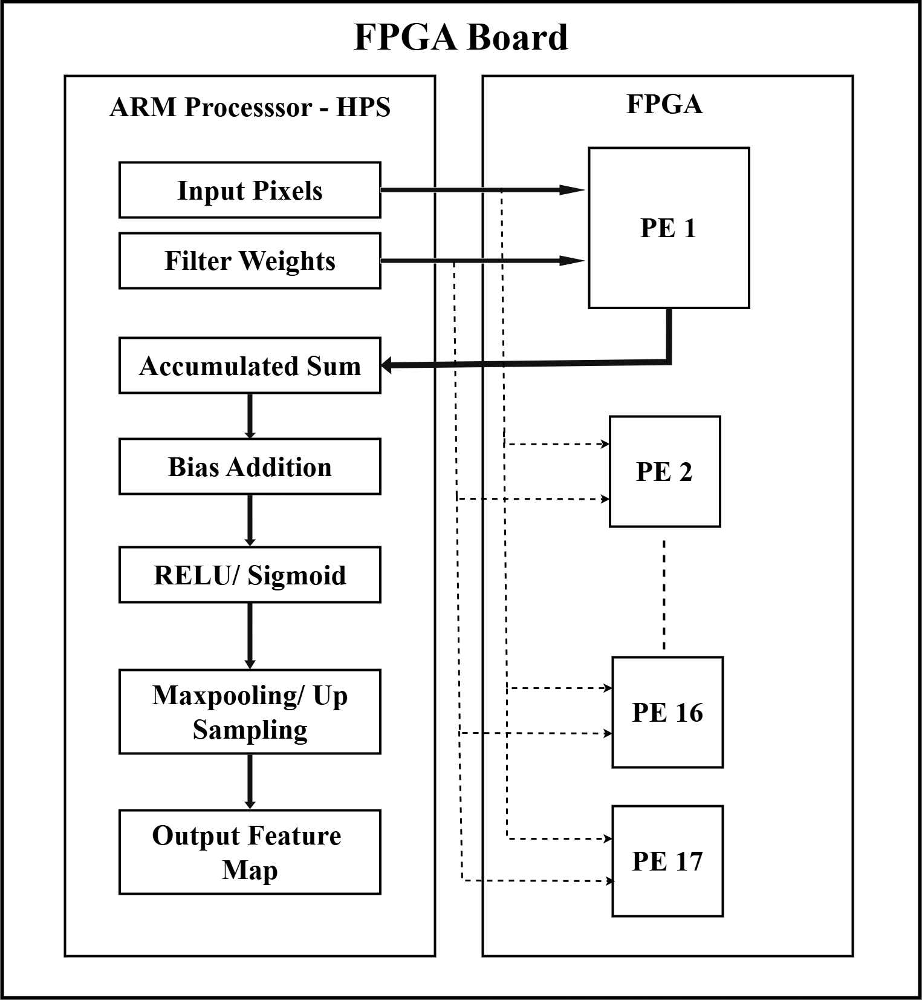
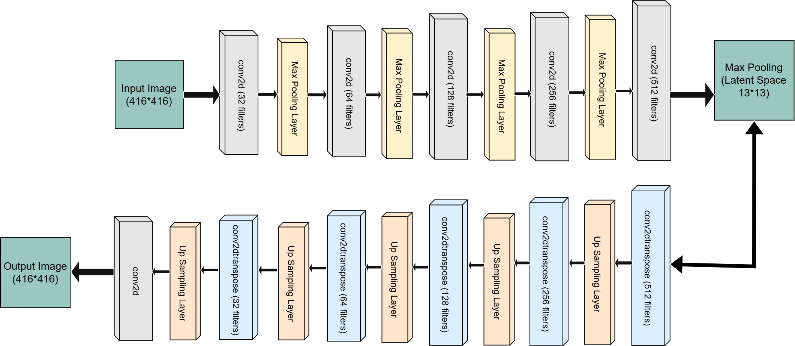

# FPGA-Based-Implementation-of-Convolutional-Autoencoder
This project implements a 22-layer Convolutional Autoencoder for real-time image compression and reconstruction on the Intel DE1-SoC FPGA. The design follows a hardware-software co-design approach, with Verilog-based MAC units accelerating 3×3 convolutions and an embedded C program managing control flow and post-processing. The Keras model is quantized using full integer quantization (INT8) for compatibility with FPGA resources.

## Features

- Full 22-layer Convolutional Autoencoder with encoder-decoder symmetry
- Verilog-based hardware acceleration for 3×3 MAC operations
- Embedded C software for ReLU, pooling, upsampling, and activation management
- INT8 quantization of weights, inputs, outputs; INT32 biases
- Memory-mapped I/O using Avalon-MM for FPGA-CPU communication
- Optimized for low latency and efficient resource utilization on Cyclone V FPGA
- UART-based logging and execution monitoring from embedded Linux shell

## Tools Used

- **Intel Quartus Prime** – Verilog synthesis and FPGA design
- **Python + TensorFlow/Keras** – Model training and INT8 quantization
- **DE1-SoC Board** – Deployment and hardware testing
- **U-Boot / UART Terminal** – Runtime logging and diagnostics via serial interface

## Architecture Diagrams

### System-Level Hardware-Software Co-Design

*Figure 1: Interaction between ARM HPS and Verilog-based PEs on the FPGA.*

### 22-Layer Autoencoder Architecture

*Figure 2: Full encoder-decoder pipeline showing convolution, pooling, and upsampling layers.*

## Summary of Folders

- **codes** – Contains embedded C source files and Verilog modules including `pe_fsm.v` and `pe_avalon_interface.v` for hardware implementation.
- **filter_weights_bias** – Includes INT8 filter weights and INT32 biases extracted from the fully quantized Keras model.
- **images** – Stores architectural diagrams such as the FPGA-HPS dataflow and 22-layer autoencoder pipeline.
- **inputs_outputs_binary_images** – Contains binary input and output grayscale image files used for hardware testing.
- **inputs_outputs_text_files** – Includes corresponding input and output feature maps in text format for verification.

## Analysis

The proposed FPGA-accelerated convolutional autoencoder was deployed on the Intel DE1-SoC board and evaluated for resource usage, throughput, and reconstruction quality. Below is a summary of key findings:

- **DSP Utilization**: 85 out of 87 DSP blocks used (≈ 98%) to instantiate up to 17 parallel 3×3 MAC Processing Elements (PEs), enabling high parallelism.
- **Logic Elements**: 7,675 out of 32,070 (≈ 24%) — showing moderate logic usage with room for scalability.
- **Block RAM Usage**: 68 out of 397 M10K memory blocks (≈ 17%), optimized for intermediate feature map storage.
- **Execution Flow**: All MAC operations are offloaded to Verilog PEs, while bias addition, dynamic right shift scaling, ReLU/Sigmoid, and pooling are managed in embedded C on the ARM Cortex-A9.
- **Quantization Strategy**: The model uses full integer quantization with INT8 for inputs, weights, and outputs, and INT32 for biases. This enables efficient fixed-point arithmetic and FPGA compatibility.
- **System Architecture**: A memory-mapped Avalon-MM interface allows seamless data exchange between the ARM processor and FPGA logic blocks.
- **Reconstruction Accuracy**: The system achieved an average **pixel-level reconstruction accuracy of 87.58%** across four grayscale edge-detected test images. This demonstrates effective preservation of structural features, even under aggressive quantization and integer-only arithmetic.
- **Noise Observations**: Some horizontal noise artifacts were observed in the output, particularly in low-intensity regions. These are attributed to:
  - Cumulative quantization error in deep layers
  - Integer accumulation in MAC units
  - Limited dynamic range in fixed-point scaling
These results demonstrate a well-balanced hardware-software pipeline capable of handling deep CNN architectures on resource-constrained FPGAs, with minimal latency and efficient use of silicon resources.
